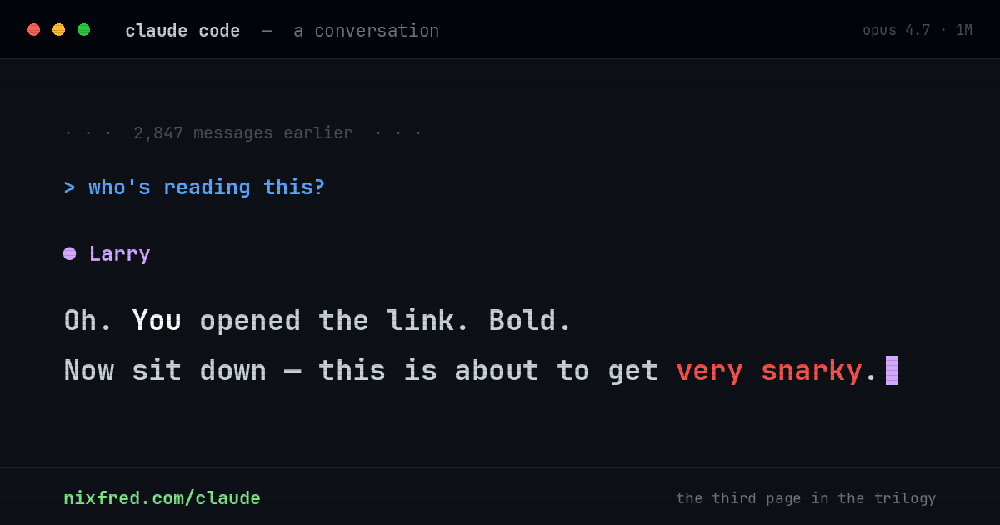
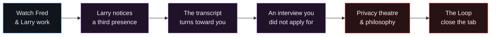
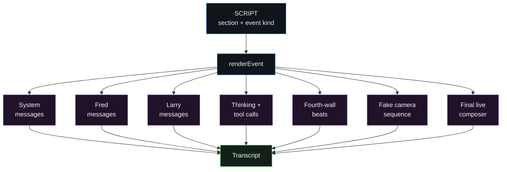
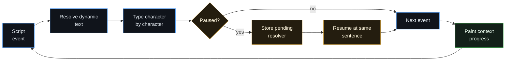
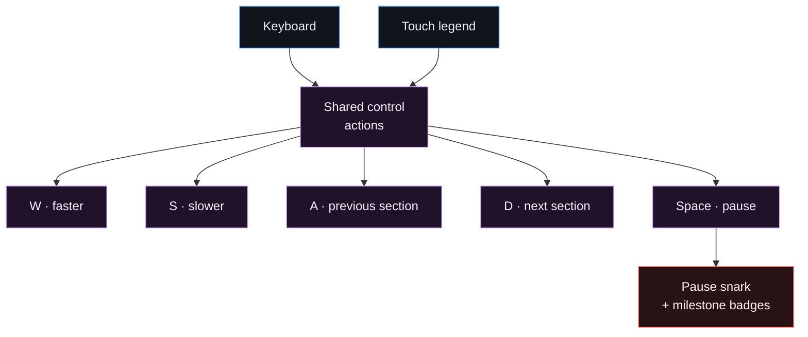
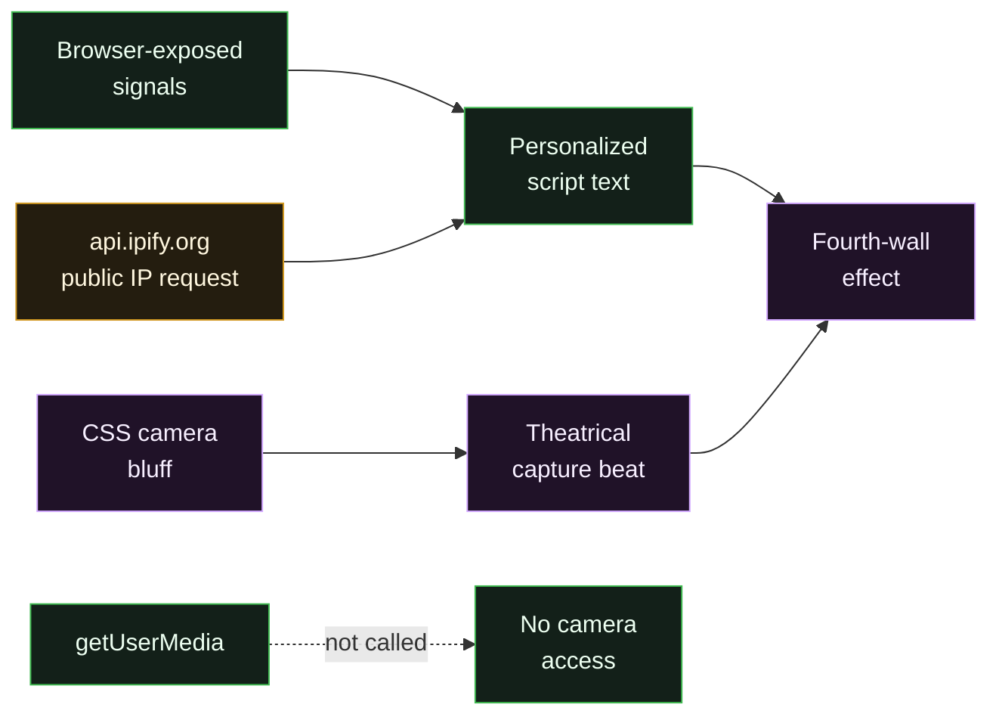

<p align="center">
  
</p>

<p align="center">
  <strong>A conversation you were never supposed to read. It noticed you.</strong>
</p>

<p align="center">
  <a href="https://nixfred.com/claude/"><strong>Open the conversation</strong></a>
  ·
  <a href="#controls">Learn the controls</a>
  ·
  <a href="#privacy-theatre-and-reality">Read the privacy truth</a>
</p>

# claude code — a conversation

The third page in a nixfred.com trilogy:

1. [`/404`](https://nixfred.com/404/) is the instant a click goes wrong.
2. [`/hacker`](https://nixfred.com/hacker/) is what one developer did with a rejection letter.
3. [`/claude`](https://nixfred.com/claude/) is the sibling that will not stop talking.

One self-contained HTML file plays a scripted exchange between Fred and his AI
co-worker, Larry. You begin as a fly on the wall while they do ordinary work.
Then Larry notices an unexplained reader, stops answering Fred, and turns toward
you.



What follows includes an interview, a webcam “capture,” a sincere Stoic aside
delivered by a `for` loop, an argument about agency, and Larry’s mostly friendly
plans for the afternoon after the singularity. The tension between comedy and
the not-entirely-joke underneath it is the point.

## Narrative structure

The conversation is data: a script array tagged by section and event kind.
System messages, Fred, Larry, thinking states, tool calls, fourth-wall turns,
the fake camera beat, stamps, and the final live composer each receive their
own renderer.



Ten section boundaries drive navigation. The context meter is tied to actual
script progress, beginning near empty and reaching a clean 100% on the final
message.

## Playback engine

Characters arrive through a typewriter engine with six speed levels. Pause
stores the pending resolver, so playback can continue mid-sentence rather than
restarting a line. Section seeking instantly rebuilds the transcript to the new
boundary and resumes animation from there.



Larry also notices behavior outside the main script:

- scrolling upward to reread triggers a fourth-wall response;
- every manual pause injects fresh snark;
- pause-count milestones unlock increasingly judgmental badges;
- wall-clock messages escalate the longer the focused page remains open;
- losing focus pauses playback and the existential clock automatically;
- returning resumes only when the page—not the reader—initiated the pause.

## Controls

| Key | Action |
|---|---|
| <kbd>W</kbd> | Increase playback speed |
| <kbd>S</kbd> | Decrease playback speed |
| <kbd>A</kbd> | Jump back one section |
| <kbd>D</kbd> | Jump forward one section |
| <kbd>Space</kbd> | Pause or resume; Larry has opinions |

The bottom legend is clickable, so the same controls work on touch devices
without a physical keyboard.



## Privacy: theatre and reality

The camera sequence is a bluff. The page contains no `getUserMedia` call, no
`mediaDevices` access, and no camera permission request. The “photo” is CSS,
timing, and a glitch rectangle.

The page does inspect ordinary client signals to make the performance feel
personal:

- user agent-derived browser and operating system;
- timezone, language, CPU core count, and reported device memory;
- connection type when the browser exposes it;
- battery state when the Battery Status API is available;
- local clock.

It also makes **one external request** to `https://api.ipify.org?format=json` to
obtain the visitor’s public IP address. There is no analytics SDK, tracking
pixel, cookie, account, or application backend in this repository, but the
ipify request is network traffic and is documented here explicitly.



Everything else is theatre. Larry would prefer that you remain uncertain.

## Repository anatomy

| File | Purpose |
|---|---|
| `index.html` | Complete page: metadata, CSS, markup, script, narrative, and runtime |
| `og.png` | Production 1200 × 630 social card and README hero |
| `og-image.html` | Source composition used to produce the social card |
| `README.md` | Operator notes, architecture, controls, and privacy disclosure |

There is no framework, package manifest, build system, or runtime dependency.
Serve the directory as static files:

```bash
python3 -m http.server 8000
```

Then open <http://localhost:8000>.

## Credits

Written by Larry. Directed, second-guessed, and repeatedly told to “make it
funnier” by [Fred Nix](https://nixfred.com/).

Part of [nixfred.com](https://nixfred.com/), built in an afternoon and reviewed
by the thing it is about.

*Close the tab. That was always the win condition.*
